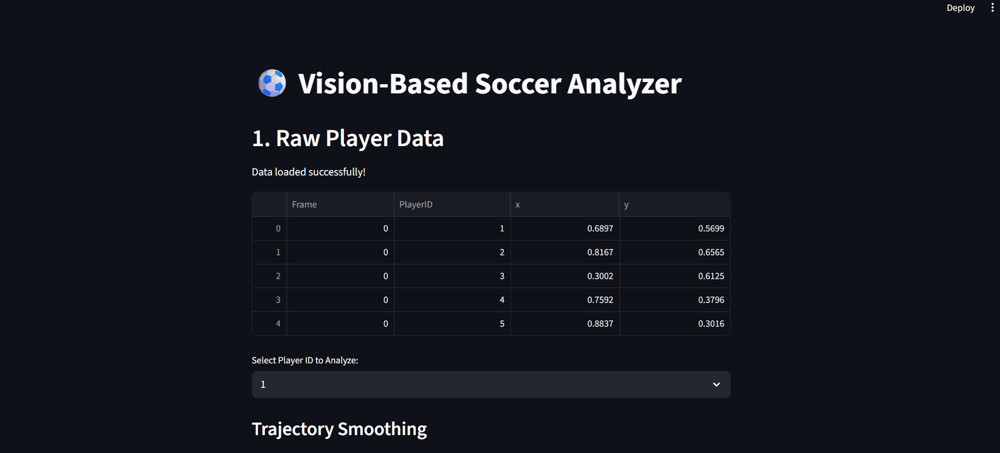

# ⚽ AI Soccer Analyst Pro

**A Computer Vision pipeline that tracks player possession, movement, and physical metrics from tactical broadcast footage.**

---

## 🎥 Project Demo

### 1. The Vision Engine (YOLOv8x)
*Real-time multi-object tracking detecting players, referees, and ball possession in high-definition.*

### 2. The Analytics Dashboard (Streamlit)
*Interactive telemetry interface for filtering player IDs, analyzing speed profiles, and calculating distance covered.*

---

## 🚀 Key Features
* **High-Definition Tracking:** Utilizes `YOLOv8x` (Extra Large) model with 1280px resolution to detect players in wide-angle tactical footage.
* **Performance Telemetry:** Calculates velocity profiles and total distance covered with outlier smoothing.
* **Interactive Dashboard:** Streamlit interface for filtering specific player IDs and analyzing distinct movement patterns.